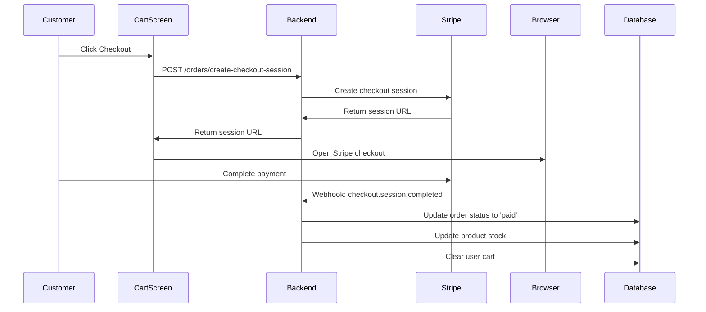

# Cart and Payment System Implementation Guide

## Overview
This guide documents the complete cart, checkout, and order management system integrated with Stripe payments for the Eco-Lens application.

## Features Implemented

### 1. **Shopping Cart System**
- ✅ Add products to cart with quantity
- ✅ Update item quantities
- ✅ Remove items from cart
- ✅ View cart with eco-score calculation
- ✅ User-specific cart persistence
- ✅ Real-time cart updates

### 2. **Stripe Payment Integration**
- ✅ Secure checkout session creation
- ✅ Stripe-hosted payment page
- ✅ Payment verification and webhook handling
- ✅ Order creation upon successful payment
- ✅ Automatic inventory management

### 3. **Order Management**
- ✅ Order history with status tracking
- ✅ Order details view
- ✅ Order cancellation (before shipping)
- ✅ Automatic refund processing
- ✅ Status updates (pending, processing, shipped, delivered, cancelled)

## Backend Architecture

### Models Created

#### **Cart Model** (`backend/models/Cart.js`)
```javascript
{
  user: ObjectId (ref: User),
  items: [{
    product: ObjectId (ref: Product),
    quantity: Number,
    price: Number
  }],
  totalAmount: Number,
  totalItems: Number,
  timestamps: true
}
```

#### **Order Model** (`backend/models/Order.js`)
```javascript
{
  user: ObjectId (ref: User),
  orderNumber: String (auto-generated),
  items: [{
    product: ObjectId,
    productName: String,
    productImage: String,
    quantity: Number,
    price: Number,
    sustainabilityScore: Number,
    sustainabilityGrade: String
  }],
  totalAmount: Number,
  totalItems: Number,
  shippingAddress: {
    fullName: String,
    addressLine1: String,
    addressLine2: String,
    city: String,
    state: String,
    postalCode: String,
    country: String,
    phone: String
  },
  paymentStatus: enum ['pending', 'paid', 'failed', 'refunded'],
  orderStatus: enum ['pending', 'processing', 'shipped', 'delivered', 'cancelled'],
  stripePaymentIntentId: String,
  stripeSessionId: String,
  paidAt: Date,
  shippedAt: Date,
  deliveredAt: Date,
  cancelledAt: Date,
  timestamps: true
}
```

### API Endpoints

#### **Cart Routes** (`/api/cart`)
- `GET /` - Get user's cart
- `POST /add` - Add item to cart
- `PATCH /update` - Update item quantity
- `DELETE /remove/:productId` - Remove item from cart
- `DELETE /clear` - Clear entire cart

#### **Order Routes** (`/api/orders`)
- `POST /create-checkout-session` - Create Stripe checkout session
- `POST /webhook` - Handle Stripe webhooks
- `GET /verify-payment/:sessionId` - Verify payment status
- `GET /my-orders` - Get user's order history
- `GET /order/:orderId` - Get order details
- `POST /cancel/:orderId` - Cancel order

### Required Environment Variables

Add these to your `backend/.env` file:

```env
# Stripe Configuration
STRIPE_SECRET_KEY=sk_test_your_stripe_secret_key_here
STRIPE_WEBHOOK_SECRET=whsec_your_webhook_secret_here

# Frontend URL (for Stripe redirect)
FRONTEND_URL=exp://localhost:8081
```

## Frontend Architecture

### New Screens Created

1. **OrderHistoryScreen** (`src/screens/customer/OrderHistoryScreen.js`)
   - Displays user's order history
   - Shows order status with color coding
   - Pull-to-refresh functionality
   - Navigate to order details

2. **OrderDetailsScreen** (`src/screens/customer/OrderDetailsScreen.js`)
   - Detailed order information
   - Shipping address display
   - Item list with eco-scores
   - Cancel order functionality

3. **Enhanced CartScreen** (`src/screens/customer/CartScreen.js`)
   - API-integrated cart management
   - Checkout modal with shipping form
   - Stripe payment integration
   - Eco-score tracking

### Services Created

#### **CartService** (`src/api/cartService.js`)
Handles all cart-related API calls:
- `getCart(token)`
- `addToCart(productId, quantity, token)`
- `updateCartItem(productId, quantity, token)`
- `removeFromCart(productId, token)`
- `clearCart(token)`

### Navigation Updates

Added to `AppNavigator.js`:
- `OrderHistory` screen
- `OrderDetails` screen

## Setup Instructions

### 1. Install Backend Dependencies

```bash
cd eco-lens/backend
npm install
```

This will install the new `stripe` package.

### 2. Configure Stripe

1. Create a Stripe account at https://stripe.com
2. Get your API keys from the Stripe Dashboard
3. Add test keys to `backend/.env`:
   ```env
   STRIPE_SECRET_KEY=sk_test_51...
   STRIPE_WEBHOOK_SECRET=whsec_...
   ```

### 3. Set Up Stripe Webhook (for Production)

1. In Stripe Dashboard, go to Developers > Webhooks
2. Add endpoint: `https://your-api-url/api/orders/webhook`
3. Select events:
   - `checkout.session.completed`
   - `payment_intent.payment_failed`
4. Copy webhook signing secret to `.env`

### 4. Start the Backend Server

```bash
cd eco-lens/backend
npm run dev
```

### 5. Start the Frontend

```bash
cd eco-lens
npm start
```

## Usage Flow

### Customer Shopping Flow

1. **Browse Products**
   - Customer views products in dashboard
   - Filters by category, eco-score, price

2. **Add to Cart**
   - Click "Add to Cart" button
   - Select quantity
   - Product added to user's cart

3. **View Cart**
   - Navigate to Cart tab
   - See all items with quantities
   - View total price and eco-score
   - Update quantities or remove items

4. **Checkout**
   - Click "Proceed to Checkout"
   - Fill in shipping address form
   - Click "Proceed to Payment"
   - Redirected to Stripe checkout page

5. **Payment**
   - Complete payment on Stripe
   - Automatic order creation
   - Inventory automatically updated
   - Cart cleared after successful payment

6. **Order Tracking**
   - View order in "Order History" (Profile tab)
   - Track order status
   - Cancel order if not yet shipped
   - View order details

## Payment Processing Flow



## Testing

### Test Cards (Stripe Test Mode)

- **Success**: 4242 4242 4242 4242
- **Declined**: 4000 0000 0000 0002
- **Requires Authentication**: 4000 0025 0000 3155

Use any future expiry date, any 3-digit CVC, and any 5-digit ZIP code.

### Testing Workflow

1. **Add Products to Cart**
   ```
   - Browse products
   - Add 2-3 items with different quantities
   - Verify cart updates correctly
   ```

2. **Test Cart Operations**
   ```
   - Update quantities
   - Remove items
   - Verify calculations
   ```

3. **Test Checkout**
   ```
   - Fill shipping address
   - Proceed to payment
   - Complete payment with test card
   - Verify order creation
   ```

4. **Test Order Management**
   ```
   - View order history
   - Check order details
   - Test order cancellation
   ```

## API Response Examples

### Get Cart Response
```json
{
  "success": true,
  "cart": {
    "items": [
      {
        "product": {
          "_id": "123",
          "name": "Eco Bamboo Toothbrush",
          "price": 4.99,
          "sustainabilityScore": 92
        },
        "quantity": 2,
        "price": 4.99
      }
    ],
    "totalAmount": 9.98,
    "totalItems": 2
  }
}
```

### Create Checkout Session Response
```json
{
  "success": true,
  "sessionId": "cs_test_123...",
  "sessionUrl": "https://checkout.stripe.com/c/pay/cs_test_123...",
  "orderId": "order_123"
}
```

### Get Orders Response
```json
{
  "success": true,
  "orders": [
    {
      "_id": "order_123",
      "orderNumber": "ECO-l1m2n3o4-ABC12",
      "totalAmount": 49.99,
      "totalItems": 3,
      "orderStatus": "processing",
      "paymentStatus": "paid",
      "createdAt": "2025-10-08T06:25:53.000Z",
      "items": [...]
    }
  ],
  "pagination": {
    "currentPage": 1,
    "totalPages": 1,
    "totalOrders": 1,
    "limit": 10
  }
}
```

## Security Features

1. **Authentication Required**: All cart and order endpoints require JWT token
2. **User Isolation**: Users can only access their own cart and orders
3. **Payment Security**: Payments handled by PCI-compliant Stripe
4. **Webhook Verification**: Stripe webhooks verified with signing secret
5. **Stock Validation**: Prevents over-ordering beyond available stock
6. **Refund Processing**: Automatic refunds for cancelled paid orders

## Error Handling

The system handles various error scenarios:

- **Insufficient Stock**: User notified before checkout
- **Payment Failure**: Order marked as failed, stock not updated
- **Network Issues**: Graceful fallbacks with user notifications
- **Invalid Data**: Validation errors with clear messages
- **Duplicate Orders**: Prevented through order state management

## Future Enhancements

- [ ] Multiple payment methods (PayPal, Apple Pay, Google Pay)
- [ ] Order tracking with shipping carriers
- [ ] Email notifications for order updates
- [ ] Saved addresses for faster checkout
- [ ] Guest checkout option
- [ ] Discount codes and promotions
- [ ] Wishlist functionality
- [ ] Product reviews and ratings integration
- [ ] Order invoice generation
- [ ] Subscription-based orders

## Troubleshooting

### Issue: Cart not loading
- **Check**: Backend server is running
- **Check**: API_BASE_URL is correctly configured
- **Check**: JWT token is valid

### Issue: Payment not processing
- **Check**: STRIPE_SECRET_KEY is set correctly
- **Check**: Using test cards in test mode
- **Check**: Network connectivity

### Issue: Order not appearing after payment
- **Check**: Webhook is configured (for production)
- **Check**: Backend logs for errors
- **Check**: Payment status on Stripe dashboard

## Support

For issues or questions:
1. Check backend logs: `npm run dev` output
2. Check frontend logs: React Native debugger
3. Verify environment variables are set
4. Test with Stripe test cards
5. Check Stripe Dashboard for payment details

## Conclusion

This implementation provides a complete, production-ready e-commerce solution with:
- Secure payment processing through Stripe
- User-specific cart management
- Order tracking and management
- Inventory control
- Modern, responsive UI

The system is designed to be scalable, secure, and maintainable for future enhancements.
